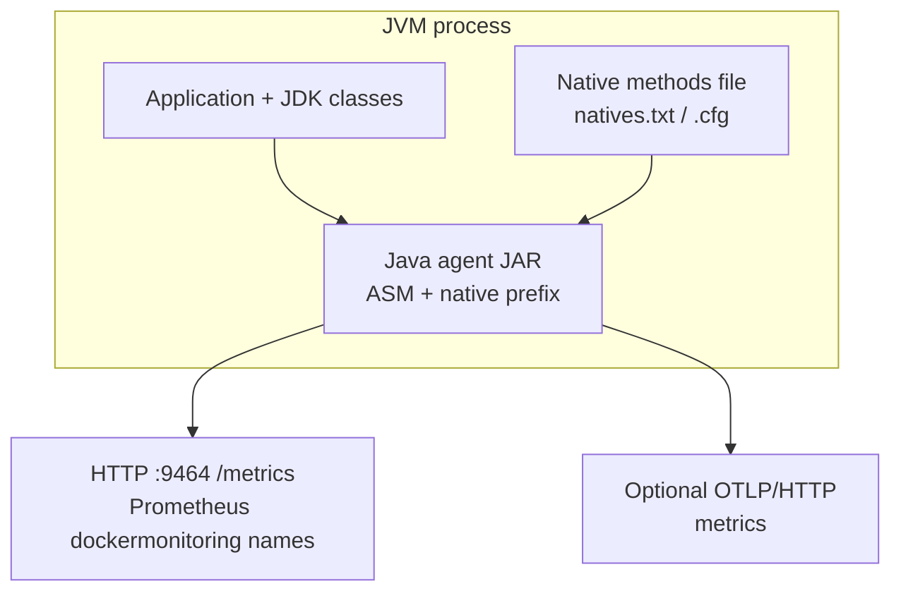
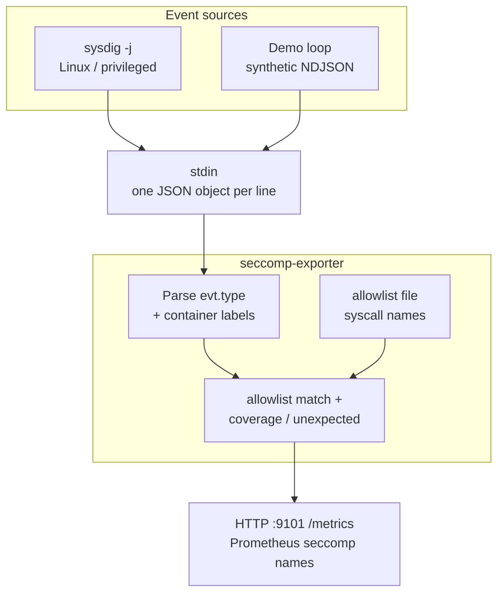
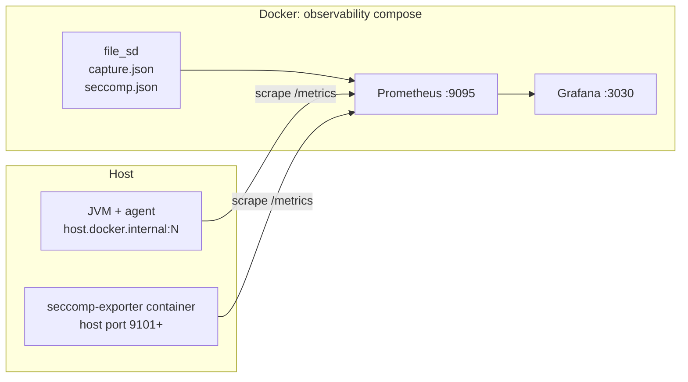
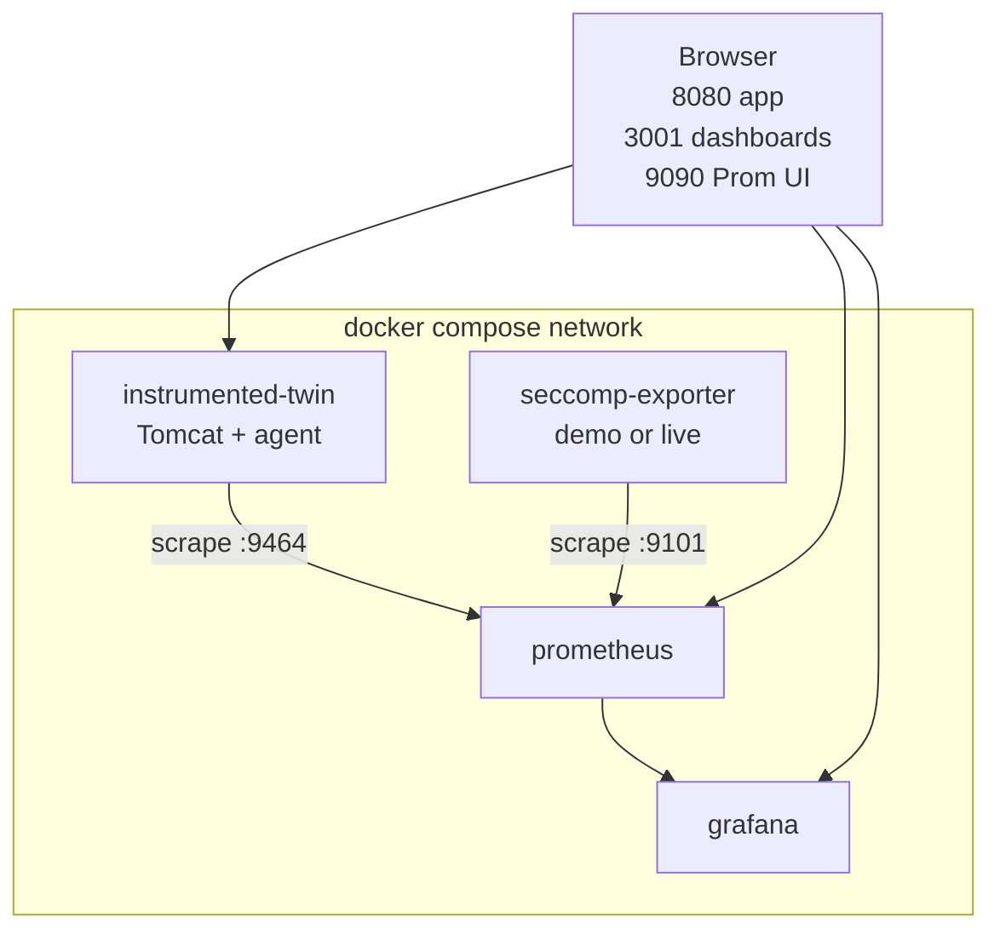

# DockerMonitoring

Java **JNI / native-method** visibility (`dockermonitoring_`*) plus **syscall / seccomp-style** metrics (`seccomp_`*) for Prometheus and Grafana.

## Architecture

Echotrace splits observability into **two independent pipelines** that answer different questions. They share Prometheus and Grafana but do **not** share config files: JNI method lists and syscall allowlists live in different namespaces.


| Pipeline             | Question it answers                                                   | Primary signals                                                        |
| -------------------- | --------------------------------------------------------------------- | ---------------------------------------------------------------------- |
| **Java agent**       | Which **native (JNI) methods** run and how often?                     | `dockermonitoring_`* counters/gauges on HTTP `/metrics`, optional OTLP |
| **Seccomp exporter** | Which **syscalls** appear, and are they **on** an expected allowlist? | `seccomp_`* counters/gauges on HTTP `/metrics`                         |


Correlating them in production is **operational** (same time window, same workload, dashboards side by side), not a built-in line-by-line mapping from `ClassName.methodName` to syscall names.

### JNI / native-method path (inside the JVM)

The agent loads as `-javaagent`, reads a method list (`-Ddockermonitoring.native.methods.file`), uses **ASM** bytecode transformation and `Instrumentation.setNativeMethodPrefix` to wrap matching natives, then exposes Prometheus text (and optionally exports OTLP metrics).




`[otel_capture.sh](../otel_capture.sh)` does not modify a running container in place: it **inspects** a target, then starts a **clone** with the agent JAR and config **bind-mounted** and JVM flags injected (e.g. `CATALINA_OPTS` for Tomcat). `[prometheus.host.yml](../observability/prometheus/prometheus.host.yml)` scrapes the resulting port via **file_sd** `[capture.json](../observability/prometheus/file_sd/)` (updated by the script when the port is non-default).


### Syscall / seccomp-style path (outside JNI naming)

`seccomp-exporter` consumes **newline**-delimited **JSON** with sysdig-shaped fields (default `**evt.type`** = syscall name, `**container.name`** for attribution). Each event is checked against `**allowlist.txt**`: allowlisted syscalls update coverage gauges; anything else increments **unexpected** syscall counters. Demo mode feeds a synthetic stream so dashboards work without **sysdig**; live mode expects `sysdig -j` (or equivalent) on **Linux** with appropriate privileges.




`[run_seccomp_exporter_demo.sh](../run_seccomp_exporter_demo.sh)` builds the image, publishes a host port (auto **9101–9120** if busy), and writes **file_sd** `[seccomp.json](../observability/prometheus/file_sd/)` for the same Prometheus instance.


### Observability plane (Stack A — host workloads + Docker dashboards)

Prometheus (in Docker) discovers targets from files under `observability/prometheus/file_sd/`. Grafana reads Prometheus as a datasource and loads provisioned dashboards (`echotrace-native`, `echotrace-seccomp`).




### Full stack (Stack B — `docker compose` at repo root)

All services attach to a single Docker network: Tomcat twin exposes **8080** and **9464**; seccomp-exporter **9101**; Prometheus **9090** scrapes both via static targets in `[observability/prometheus/prometheus.yml](../observability/prometheus/prometheus.yml)` (mounted into the Prometheus container by `[docker-compose.yml](../docker-compose.yml)`); Grafana **3001** → **3000** in-container.




## Layout


| Path                                     | Role                                                                                        |
| ---------------------------------------- | ------------------------------------------------------------------------------------------- |
| `[agent/](agent/)`                       | `-javaagent` JAR; wraps listed native methods, Prometheus `/metrics`, optional OTLP.        |
| `[seccomp-exporter/](seccomp-exporter/)` | Go: sysdig-style NDJSON → `/metrics` (`seccomp_*`; allowlist + coverage).                   |
| `[tomcat-twin/](tomcat-twin/)`           | Sample Tomcat image + `[native-methods.cfg](tomcat-twin/native-methods.cfg)` for the agent. |
| `[tomcat/](tomcat/)`                     | Example **per-workload** files: JNI list + syscall allowlist (see below).                   |
| `[docs/](docs/)`                         | Seccomp / sysdig runbooks.                                                                  |
| `[../observability/](../observability/)` | Prometheus + Grafana compose (used by `start_dashboard.sh`).                                |


## Working directory (important)

Many paths are written for the **repository root** (`Echotrace/`, parent of this folder).


| You are in…             | Build seccomp image…                                                                                                    | Bind `tomcat/allowlist.txt`…                                                    |
| ----------------------- | ----------------------------------------------------------------------------------------------------------------------- | ------------------------------------------------------------------------------- |
| **Repo root**           | `docker build -t dm-seccomp-exporter -f DockerMonitoring/seccomp-exporter/Dockerfile DockerMonitoring/seccomp-exporter` | `-v "$PWD/DockerMonitoring/tomcat/allowlist.txt:/etc/seccomp/allowlist.txt:ro"` |
| `**DockerMonitoring/`** | `docker build -t dm-seccomp-exporter -f seccomp-exporter/Dockerfile seccomp-exporter`                                   | `-v "$PWD/tomcat/allowlist.txt:/etc/seccomp/allowlist.txt:ro"`                  |


If you mix the two (e.g. `DockerMonitoring/DockerMonitoring/...`), Docker builds fail or bind mounts break.

Wrapper scripts in `**DockerMonitoring/`** (`start_dashboard.sh`, `otel_capture.sh`, `run_seccomp_exporter_demo.sh`) `exec` the copies under **repo root** so behavior is consistent.

## `tomcat/` — two different lists


| File                                           | Consumed by                                                                       | Format                                              | What it does                                                               |
| ---------------------------------------------- | --------------------------------------------------------------------------------- | --------------------------------------------------- | -------------------------------------------------------------------------- |
| `[tomcat/natives.txt](tomcat/natives.txt)`     | Java **agent** (`-Ddockermonitoring.native.methods.file=…`)                       | `ClassName.methodName` per line                     | Methods to **instrument**; metrics count invocations.                      |
| `[tomcat/allowlist.txt](tomcat/allowlist.txt)` | **seccomp-exporter** (`--allowlist-file` / mount at `/etc/seccomp/allowlist.txt`) | Linux **syscall** name per line (`read`, `open`, …) | Each event’s `evt.type` (or `-syscall-field`) is checked against this set. |


They are **not** the same namespace: JNI method names are **not** compared to the syscall allowlist by any single tool. To relate them operationally, run **both** exporters while you exercise the app and use Grafana/Prometheus side by side.

---

## Stack A — Host metrics + dashboards (typical on macOS)

Uses `**./start_dashboard.sh`** → `[observability/](../observability)`: **Grafana :3030**, **Prometheus :9095** (avoids clashing with :3000 / :9090). Prometheus reaches the JVM on the host via `host.docker.internal` and **file_sd** under `[observability/prometheus/file_sd/](../observability/prometheus/file_sd/)`.

1. **Start dashboards** (from repo root **or** `DockerMonitoring/` via wrapper):
  ```bash
   ./start_dashboard.sh
  ```
2. **Instrument a running container** — inspects the container, then runs a **clone** with the agent JAR and native-methods file mounted (does not patch the original container in place):
  ```bash
   ./otel_capture.sh <container_name_or_id> DockerMonitoring/tomcat/natives.txt
  ```
   Sets an ephemeral scrape port if **9464** is busy and refreshes `file_sd/capture.json`. Output may include `runtime_native_methods.txt` in the repo root.
3. **Seccomp metrics (demo stream)** — synthetic NDJSON so `seccomp_`* panels work without sysdig:
  ```bash
   ./run_seccomp_exporter_demo.sh
  ```
   Use **your** allowlist (path is resolved from **repo root** if relative):
   Env vars: `SECCOMP_EXPORTER_HOST_PORT`, `SECCOMP_ALLOWLIST_FILE` (see script header in `[run_seccomp_exporter_demo.sh](../run_seccomp_exporter_demo.sh)`).

For **real** syscalls, pipe sysdig NDJSON into the exporter (Linux / privileged); see `[docs/seccomp-sysdig.md](docs/seccomp-sysdig.md)` and `[seccomp-exporter/README.md](seccomp-exporter/README.md)`.

---

## Stack B — All-in-one `docker compose` (repo root)

`[../docker-compose.yml](../docker-compose.yml)` runs Tomcat twin, seccomp-exporter **demo**, Prometheus **:9090**, Grafana **:3001** on one network.

```bash
cd /path/to/Echotrace
docker compose up --build
```

- Tomcat: [http://localhost:8080](http://localhost:8080)  
- JVM metrics: [http://localhost:9464/metrics](http://localhost:9464/metrics)  
- Seccomp exporter: [http://localhost:9101/metrics](http://localhost:9101/metrics)  
- Prometheus: [http://localhost:9090](http://localhost:9090)  
- Grafana: [http://localhost:3001](http://localhost:3001) (default `admin` / `admin`)

To use a **custom** allowlist with the compose `seccomp-exporter` service, add a volume that mounts your file over `/etc/seccomp/allowlist.txt` (see `[seccomp-exporter/docker-entrypoint.sh](seccomp-exporter/docker-entrypoint.sh)`).

---

## Java agent quick build

```bash
cd DockerMonitoring/agent
mvn clean package -DskipTests
```

Artifact: `DockerMonitoring/agent/target/docker-monitoring-agent.jar`

### JVM properties (summary)


| Property                                                             | Meaning                              |
| -------------------------------------------------------------------- | ------------------------------------ |
| `-Ddockermonitoring.native.methods.file=/path/to/list.txt`           | One `ClassName.methodName` per line. |
| `-Ddockermonitoring.output.file=/path/to/runtime_native_methods.txt` | Invocation dump.                     |
| `-Ddockermonitoring.metrics.port=9464`                               | Prometheus text port.                |
| `-Ddockermonitoring.otlp.endpoint=http://collector:4318`             | OTLP/HTTP metrics (optional).        |


Additional properties: `-Ddockermonitoring.metrics.host=0.0.0.0`, `-Ddockermonitoring.maps.poll.seconds=30` (Linux `.so` discovery from `/proc/self/maps`), `-Ddockermonitoring.service.name=…`, `-Ddockermonitoring.otlp.export.interval.seconds=10`.

Native methods use bytecode prefix `$$dm$$_` via `Instrumentation.setNativeMethodPrefix`.

### OpenTelemetry (OTLP/HTTP metrics)

The agent exports OTLP when **either** `-Ddockermonitoring.otlp.endpoint` **or** `OTEL_EXPORTER_OTLP_ENDPOINT` is set. Use the OTLP/HTTP base URL your collector expects (often `http://otel-collector:4318`). If you see HTTP 404, try appending `/v1/metrics` for your exporter version.


| Input                         | Meaning                                                   |
| ----------------------------- | --------------------------------------------------------- |
| `OTEL_EXPORTER_OTLP_ENDPOINT` | Same role as the property above if the property is unset. |
| `OTEL_SERVICE_NAME`           | Same as `-Ddockermonitoring.service.name` if unset.       |


Instrument names (OTLP): e.g. `dockermonitoring.native_method.invocations` (attributes `class`, `method`), `dockermonitoring.native_methods.distinct`, `dockermonitoring.native_library.mapped` (`path`). Prometheus scrape names remain `dockermonitoring_`* on the metrics port.

### Sample harness

```bash
cd DockerMonitoring/agent
./run-sample.sh
```

---

## Grafana dashboards

Bundled under `[../observability/grafana/dashboards/](../observability/grafana/dashboards/)`:

- **Echotrace — Native methods** (`echotrace-native`) — `dockermonitoring_`*
- **Echotrace — Seccomp / syscalls** (`echotrace-seccomp`) — `seccomp_`*

---

## License

Same as the parent repository.
